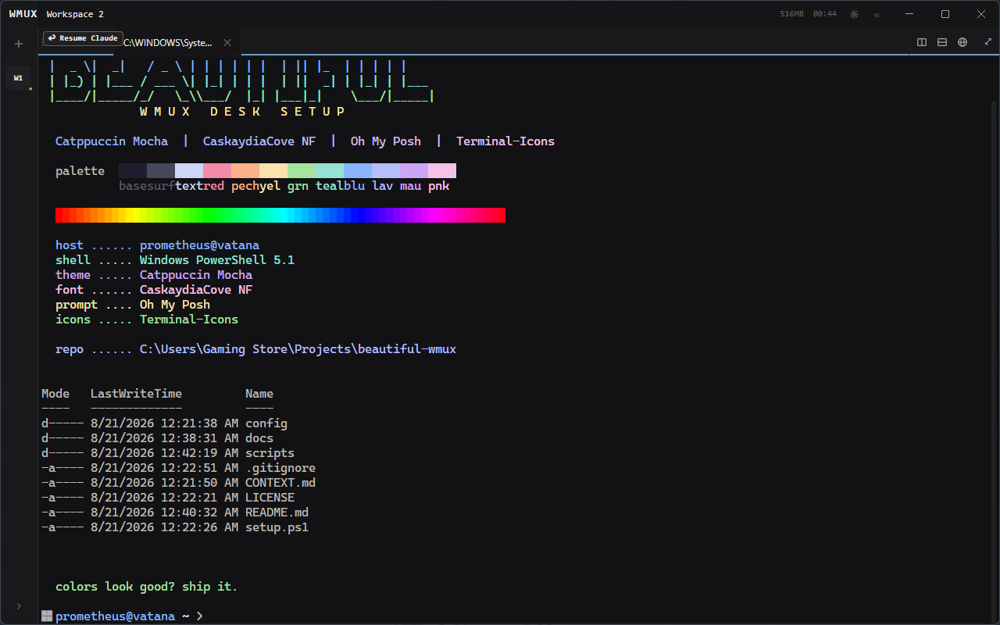

# beautiful-wmux

Windows bootstrap for a colorful **wmux** desk setup.

Installs wmux, sets **Catppuccin** + **CaskaydiaCove NF**, and configures a Catppuccin Mocha PowerShell prompt (Oh My Posh, Terminal-Icons, PSReadLine colors).

## Example



Reproduce the colorful demo:

```powershell
.\scripts\Show-ColorDemo.ps1
```

## Requirements

- Windows 10/11
- PowerShell 5.1+
- Network access (winget / downloads)

## Quick start

```powershell
git clone https://github.com/vatana7/beautiful-wmux.git
cd beautiful-wmux
Set-ExecutionPolicy -Scope CurrentUser RemoteSigned
.\setup.ps1
```

Re-run safely (skips finished steps):

```powershell
.\setup.ps1
```

Overwrite configs:

```powershell
.\setup.ps1 -Force
```

Auto-answer "quit wmux?" with yes (for non-interactive use):

```powershell
.\setup.ps1 -YesQuit
```

## What it does

| Step | Script |
|------|--------|
| Install wmux | `scripts/Install-Wmux.ps1` |
| Install Oh My Posh + theme | `scripts/Install-OhMyPosh.ps1` |
| Install Terminal-Icons | `scripts/Install-TerminalIcons.ps1` |
| Install PowerShell profile | `scripts/Set-PowerShellProfile.ps1` |
| Install CaskaydiaCove NF | `scripts/Install-NerdFont.ps1` |
| Apply Catppuccin + font in wmux | `scripts/Set-WmuxTheme.ps1` |

`Set-WmuxTheme.ps1` asks before it quits wmux, patches `%APPDATA%\wmux\session.json`, then reopens wmux.

## Why boxes appear in the prompt

Oh My Posh needs a Nerd Font. If wmux still uses Cascadia Code, you see empty rectangles. Set the terminal font to **CaskaydiaCove NF**.

## Layout

```
beautiful-wmux/
  setup.ps1
  README.md
  CONTEXT.md
  docs/
    wmux-example.png
  config/
    catppuccin-mocha.omp.json
    Microsoft.PowerShell_profile.ps1
  scripts/
    Install-Wmux.ps1
    Install-OhMyPosh.ps1
    Install-TerminalIcons.ps1
    Set-PowerShellProfile.ps1
    Install-NerdFont.ps1
    Set-WmuxTheme.ps1
    Show-ColorDemo.ps1
```

## License

MIT
